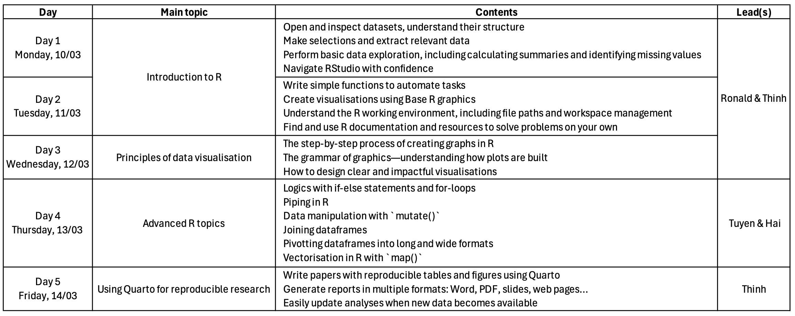

# Welcome to the OUCRU introduction to Medical Statistics 2026 {.unnumbered}

## Course structure {.unnumbered}

- The training will be **09:00 – 17:00 (UTC +7)** for everyday
- There will be a **lunch break between 12:30 – 13:30 (UTC +7)**
- Lunch will be provided for in-person attendees

## Contributors {.unnumbered}

- Prof. Ronald Geskus, Biostatistics group, OUCRU HCM
- Dr. Thinh Ong Phuc, Mathematical Modeling group, OUCRU HCM
- Mr. Tuyen Huynh, Mathematical Modeling group, OUCRU HCM
- Dr. Tran Thai Hung, Biostatistics group, OUCRU HCM
- Ms. Anh Phan Truong Quynh, Mathematical Modeling group, OUCRU HCM
- Dr. Hai Ho Bich, Emerging Infections group, OUCRU HCM
- Dr. Duc Du Hong, Biostatistics group, OUCRU HCM
- Mr. Manh Nguyen Duc, Mathematical Modeling group, OUCRU HCM
- Mr. Nguyen Pham Nguyen The, Mathematical Modeling group, OUCRU HCM
- Dr. Marc Choisy, Mathematical Modeling group, OUCRU HCM
- Dr. Dung Vu Tien Viet, Biostatistician, OUCRU Hanoi
- Dr. Trinh Dong Huu Khanh, formerly: Biostatistics group, OUCRU HCM

# Pre-course setups and requirements

Please follow [this handout](handouts/precourse_setup.qmd){target="_blank"} before joining the course.

# Course topics

## Introduction to R

### 🧑‍🏫️ Lead instructors: Ronald and Thinh

### Day 1 

- [Lecture slides](slides/IntroductionRDay1.qmd)
- Contents:
  - Open and inspect datasets, understand their structure
  - Make selections and extract relevant data
  - Perform basic data exploration, including calculating summaries and identifying missing values
  - Navigate RStudio with confidence
- Exercises:
  - [Handout file](handouts/exercises_Day1.qmd){target="_blank"}
  - [Exercise answer key](handouts/exercises_Day1_answer.qmd){target="_blank"}
  - [Exercise answer script](handouts/exercises_Day1_answer.R){target="_blank"}
- [Example R code scripts - Day 1](slides/Scripts/ExampleCodeDay1.R){target="_blank"}

### Day 2

- [Lecture slides](slides/IntroductionRDay2.qmd)
- Contents:
  - Write simple functions to automate tasks
  - Create visualisations using Base R graphics
  - Understand the R working environment, including file paths and workspace management
  - Find and use R documentation and resources to solve problems on your own
- No exercises given
- [Example R code scripts - Day 2](slides/Scripts/ExampleCodeDay2.R){target="_blank"}

## Day 3: Principles of data visualisation

### 🧑‍🏫️ Lead instructors: Ronald and Thinh

- [Lecture slides](slides/viz.qmd)
- Contents:
  - The step-by-step process of creating graphs in R
  - The grammar of graphics—understanding how plots are built
  - How to design clear and impactful visualisations
- [Handout file](handouts/VisualisationHandouts.pdf)
- Exercises:
  - [Exercise file](handouts/exercises_Day3.qmd)
  - [Exercise answer key](handouts/Exercises_Day3_answer.pdf)
  - [Exercise answer script](handouts/Exercises_Day3_answer.R)
  - Datasets: 
    - [NightingaleRose.csv](https://github.com/OUCRU-Modelling/R-training-2025/raw/refs/heads/main/slides/data/NightingaleRose.csv) 
    - [ICUCost.csv](https://github.com/OUCRU-Modelling/R-training-2025/raw/refs/heads/main/slides/data/ICUCost.csv)

## Day 4: Advanced R topics

### 🧑‍🏫️ Lead instructors: Tuyen and Hai

- [Lecture slides](slides/advance_r.qmd)
- Contents:
  - Logics with if-else statements and for-loops
  - Piping in R
  - Data manipulation with `mutate()`
  - Joining dataframes
  - Pivotting dataframes into long and wide formats
  - Vectorisation in R with `map()`

## Day 5: Using Quarto for reproducible research

### 🧑‍🏫️ Lead instructor: Thinh

- [Lecture slides](slides/qt-repro-res.qmd)
- Contents:
  - Write papers with reproducible tables and figures using Quarto
  - Generate reports in multiple formats: Word, PDF, slides, web pages…
  - Easily update analyses when new data becomes available
- [Exercises](handouts/exercises_Day5.qmd){target="_blank"}
- [Exercise answer keys]{style="cursor:not-allowed;user-select:none;"}

# Appendix

## Introduction to R and RStudio

Good introduction, with explanatory videos:

- RStudio provides several tutorials for beginners and more advanced users: https://education.rstudio.com/
- Datacamp provides many courses at different levels (OUCRU HCMC has a license). See http://www.statmethods.net. The [introduction](https://www.datacamp.com/courses/free-introduction-to-r) is free
- A basic course, interactive design: https://www.quantargo.com/courses/course-r-introduction
- Introduction from Pasteur institute: https://hub-courses.pages.pasteur.fr/R_pasteur_phd/First_steps_RStudio.html
- Good summary of basic concepts: http://www.burns-stat.com/documents/tutorials/impatient-r
- A comprehensive introduction: https://github.com/matloff/fasteR
- Introduction to R programming: https://jjallaire.github.io/hopr/

## DeepeR into R

- The book [R for Data Science (2e)](https://r4ds.hadley.nz/)
- ["What They Forgot to Teach You About R"](https://rstats.wtf/index.html)
- https://www.r-project.org/doc/bib/R-books.html
- The official R manuals: https://cran.r-project.org/manuals.html

## R and statistics

- A simple introduction to biomedical statistics using R: https://a-little-book-of-r-for-biomedical-statistics.readthedocs.io/en/latest/
- A website with detailed examples of all types of statistical analysis: https://stats.oarc.ucla.edu/other/dae/
- R by example: http://www.mayin.org/ajayshah/KB/R/index.html 
- [R course, with focus machine learning](https://www.udemy.com/course/data-science-and-machine-learning-bootcamp-with-r/)

## R Markdown and Quarto

- The main RStudio webpage on R Markdown, with links to two freely available books: https://rmarkdown.rstudio.com/docs/
- [Introduction](https://rmarkdown.rstudio.com/lesson-1.html) from RStudio
- [Introduction to `knitr`](https://sachsmc.github.io/knit-git-markr-guide/knitr/knit.html)
- [First steps in Markdown](https://www.r-bloggers.com/2022/02/how-to-use-r-markdown-part-one/)
- Writing academic papers with R Markdown (focus on bibiliographies): https://ikashnitsky.github.io/2019/zotero/
- R Markdown tips: https://appsilon.com/r-markdown-tips/
- Powerpoint presentations using R Markdown: https://appsilon.com/r-markdown-powerpoint-presentation/
- https://codingclubuc3m.rbind.io/post/2019-09-24/ focus on creating presentations
- R Quarto tutorial: https://appsilon.com/r-quarto-tutorial/

## R GUIs

