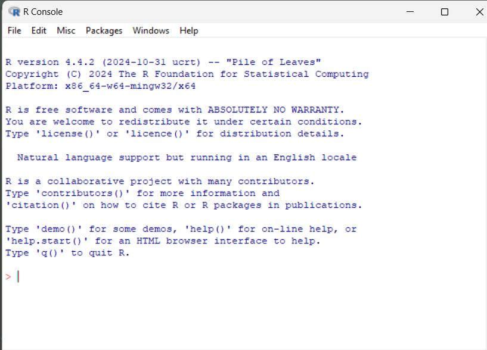
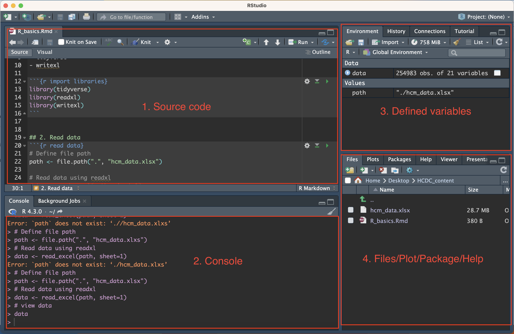

## Learning goals {.smaller} 

Become familiar and confident with the R program, using RStudio

Not: using R for statistics, bioinformatics or mathematical modeling

::: {.fragment}
- Day 1
  - Basic structure of the R program and language
    - Basic computations and selections
	- Objects and functions
  - Use the RStudio working environment	
  - Import, inspect and manage a data set
    - Select variables (columns) and rows (observations)
	- Missing data, factors, dates
:::

::: {.fragment}
- Day 2
  - Functions, R graphics, finding further information
::: 


# The R program

## R: What is it and why use it? 

- On [R Project website](http://www.r-project.org/about.html){target="_blank"}: "a language and environment for statistical computing and graphics"

- Free: no money charged and open source
- Runs on all major operating systems
- Very flexible and powerful
  -   **Reproducibility**: see Friday course
  -   **Community**: large, collaborative user base
- Steep learning curve(?)

## The R phenotypes 

- R program: very basic functionality via menus

::: {.fragment .fig-rm-on-exit}
{width=60%}
:::

::: {.fragment}
- RStudio: user-friendly shell around R
:::

::: {.fragment}
* Most analyses performed via writing code in file. 

  Classical format: script file with "`.R`" extension. 
  
  Newer formats: R Markdown ("`.Rmd`") and Quarto ("`.qmd`")
:::

::: {.fragment}
- [Graphical User Interface](https://r4stats.com/articles/software-reviews/r-gui-comparison/){preview-link="true"} e.g. BlueSky, R-Instat, R-Commander
:::

# Basics of the R Language

## R as a pocket calculator I {.scrollable}

Many mathematical operations (`+`,  `-`,  `*`,  `/`,  `^` or `**`) pre-defined

Add numbers 2 and 7:
```{webr-r}

```

Multiply 2 and 7:
```{webr-r}

```

Divide 7 by 2:
```{webr-r}

```

Compute $2^7$:
```{webr-r}

```

## R as a pocket calculator II {.scrollable}

Some operations based on functions: `sqrt`, `log`, `log2`, `log10`, `sum`, `prod`

Compute the square root of 2:
```{webr-r}
sqrt(2)
```

Sum of numbers 1 to 5:
```{webr-r}
sum(1:5)
```

Take the 10-log of 1000 (y with $10^y=1000$):
```{webr-r}

```

Some constants ($\pi$, ...) pre-defined:
```{webr-r}

```


## Assignment 

Assign value 2 to object x and show content of x
```{webr-r}
x <- sqrt(2) 
print(x)     # show value
x            # shortcut for print(x)
print(x, 10) # more digits
```

Without assignment, x keeps old value
```{webr-r}
x^2
x 
x <- x^2 # overwrite value
x
```

## Datasets {.smaller .scrollable}

- Most often rectangular format
  - Columns: variables
  - Rows: observations
- Example: [titanic3](https://hbiostat.org/data/repo/ctitanic3){target="_blank"} data set; passenger
  characteristics and survival status after disaster with the [Titanic cruise ship](https://www.encyclopedia-titanica.org/)


```{webr-r}
#| label: "Create sample titanic data"
#| context: setup
titanic <- data.frame(
    pclass=rep(c("1st","2nd","3rd"),c(4,2,4)),
    survived=c(1,0,0,0,1,1,0,0,0,0),
    name=c("Allison, Master. Hudson Trevor","Dulles, Mr. William Crothers","McCarthy, Mr. Timothy J","Walker, Mr. William Anderson", "Duran y More, Miss. Asuncion", "Mellinger, Miss. Madeleine Viol","Abbott, Master. Eugene Joseph", "Calic, Mr. Petar","Flynn, Mr. James", "Johnston, Miss. Catherine Helen"),
    age= c(0.9167,39,54,47,27,13,13,17,NA,NA),
	fare=c(151.55,29.7,51.8625,34.0208,13.8583,19.5,20.25,8.6625,7.75,23.4))
```

For now, we work with subset of titanic data set:
```{webr-r}
#| label: "Example: titanic data"
titanic 
```

## Data: selections within a single column {.smaller .scrollable}

- Each column is a <span style="color:red;">vector</span> of values
- Single column from data set selected via "`$`", e.g. `titanic$age`
- Elements of vector selected via numbers within square brackets `[ ]`

Select age of passengers 6 and 10
```{webr-r}
#| label: "age selections 6 and 10"
titanic$age[6,10]    # gives an error
titanic$age[c(6,10)] # c is function to combine values
```

Select age of passengers 6 to 10
```{webr-r}
#| label: "selection of range in age column"
titanic$age[c(6,7,8,9,10)] 
6:10               # short notation for c(6,7,8,9,10)
seq(6,10,by=1)     # same as 6:10
titanic$age[6:10] 
```

Flexibility of `seq` function
```{webr-r}
#| label: "more selections in age column"
seq(1,10,by=2)     # only odd numbers
## select age in the odd rows:

```

## Data: selection of rows and columns {.smaller}

- Via square brackets `dataset[rows, cols]`

```{webr-r}
#| label: "selections in data"
## 2 rows and columns 3 and 1
titanic[2:3, c(3,1)]
titanic[6,10]
## That's why titanic$age[6,10] is not allowed
```

Columns: selection by name
```{webr-r}
 titanic[c(2,3), c("name","pclass")]
```


## Exercise 1 {.smaller .scrollable}

a. Create a vector named `vec` that consists of the numbers from 11 to 30
b. Select the 7th element of the vector
c. Select all elements except the 15th. Hint: use a minus sign
d. Select the 2nd and 5th element of the vector
```{webr-r}
## assign numbers to vec

## make selections within vec

```
e. Select only the odd valued elements of `vec`. 

  *Remark: Exercise e. is not an easy exercise. We advise you to do this is in two
  steps. First create a vector `index` that selects the odd numbers in `vec`, using the
  function `seq`. You may need to consult the help page of `seq` via `help(seq)`.*

```{webr-r}
## first select position of odd numbers in 11:30
## assign this to index

```


::: sol

## Exercise 1 (answer) {.smaller}

- Create a vector named `vec` that consists of the numbers from 11 to 30
- Select the 7th element of the vector
- Select all elements except the 15th. Hint: use a minus sign
- Select the 2nd and 5th element of the vector
- Select only the odd valued elements of `vec`.

```{.r}
vec <- seq(11,30)
vec[7]
## Use '-' to exclude elements
vec[-15]
## Use the concatenate function 'c'
vec[c(2,5)]
## odd numbers
index <- seq(1,length(vec),by=2)
vec[index]
```

:::

## Exercise 2 {.smaller .scrollable}

Use the elementary functions `/`, `-`, `^` and the function `sum` to
    calculate the mean $$\bar{x}=\sum_{i=1}^n x_i/n$$ and the standard deviation
    $$\sqrt{\sum_{i=1}^{n}(x_i-\bar{x})^2/(n-1)}$$ of the fare paid by the titanic
    passengers. Note: $n=10$. Verify your answer by using the built-in R functions `mean`
    and `sd`.
```{webr-r}
## compute mean:

## compute sd:

## verify by comparing with functions mean and sd:

```

::: sol
## Exercise 2 (with answer) {.smaller}

Use the elementary functions `/`, `-`, `^` and the function `sum` to
    calculate the mean $$\bar{x}=\sum_{i=1}^n x_i/n$$ and the standard deviation
    $$\sqrt{ \sum_{i=1}^n (x_i-\bar{x})^2/(n-1)}$$ of the fare paid by the titanic
    passengers. Note: $n=10$. Verify your answer by using the built-in R functions `mean`
    and `sd`.
```{.r}
fare <- titanic$fare
MeanFare <- sum(fare)/length(fare)
MeanFare
mean(fare)
# Calculate the standard deviation in three (baby) steps
numerator <- sum((fare-MeanFare)^2)
denominator <- (length(fare)-1)
StdFare  <- sqrt(numerator/denominator)
StdFare
sd(fare)
```
:::

## Functions (I)

::: {.fragment fragment-index=1}

- A function is how we tell the computer to do work for us

- Think of it like asking someone to complete a task for you

:::

::: {.fragment fragment-index=2}
**Example**

Thinh told Ronald: ***"Please give feedback on my measles model manuscript before next Friday"***. How does this translate into R?
:::

::: {.fragment fragment-index=3}
```
give_feedback(type = "manuscript", which = "measles model", deadline = "next Friday")
```
:::

## Functions (II) {.smaller}

::: {.incremental}
- Everything we do in R boils down to running a function:
 
  Generates some output given some input:
  
  `goal( input1, input2, ...)`
  - **goal**: what do we want; function name
  - **input**: what information does R need for this; <span style="color:red;">arguments</span> of the function
- Output: a value (often assigned to an object for further use); a figure; a help page, ...
 
  E.g. `help(mean)`: `mean` is argument of function `help`. Output is the appearance
  of a page with information on the `mean` function
- Many calculation functions are vectorized

  Example: change unit of age to decade (10 years)
  ```{webr-r}
  #| label: "vectorized calculations"
  titanic$age/10 # age per 10 years for each person  
  ```
  What does this give:
  ```{webr-r}
  c(2, 15) + c(10, -3)
  ```

:::

## Objects {.smaller}

- Everything in R is an object (data, functions, results from analysis, ...)
- Names for user created objects:
    `patients, Data, abc, LetsHaveFun`
- Names are case-sensitive: `Data` is not the same as `data`

::: {.fragment}
- Not allowed:
  - space
  - characters with special meaning in R: "`@`", "`$`", "`+`" etc.
  - numbers allowed but not as first character
  - specific R programming constructs: `for, if, while` ...
- Better avoid names that are R functions:

  `sort, c, mean, t, data, q`
:::

::: {.fragment}
- "`_`" and "`.`" are allowed (e.g. `sorted.results_file`)

  Many prefer "`_`" over "`.`" to subdivide names
:::

## Remember

::: {.callout-note title="Objects and functions"}
1. Everything that exists in R is an **object** (data, functions, ...)

2. Everything that happens in R is a **function** call
:::


## Modes {.smaller .scrollable}

- Data (variables) come in different types. The most important ones are:
  - *numeric*:
```{webr-r}
seq(0,2,by=0.25)
```
  - *logical*: values `TRUE` and `FALSE`
```{webr-r}
-2 < 2
```
  - *character*: 
```{webr-r}
c("Thinh", "Ronald")
letters
```
  - You can change the mode of some data objects
```{webr-r}
as.character(seq(0,2,by=0.25))
as.numeric(c(FALSE,TRUE))
```

## Modes: logical (I) {.smaller .scrollable}

- `TRUE` and `FALSE` can be used for selection
```{webr-r}
#| label: logical mode Ia
titanic$fare
titanic$fare[c(TRUE,FALSE,TRUE,TRUE, FALSE, TRUE,FALSE,TRUE,TRUE, FALSE)] 
```

- Logical statements arise from comparing values:
  - Smaller/larger than: `<`, `>`, `<=`, `>=`
  - Exact equality: `==`
  - Not equal to: `!=`
```{webr-r}
#| label: logical mode Ib
titanic$fare>40
titanic$pclass[titanic$fare>40]
"Thinh" > "Ronald"
```
- Converted to integer if a numeric value is required:

  `TRUE` equals 1, `FALSE` equals 0
  
```{webr-r}
#| label: logical mode Ic
titanic$pclass=="1st"
sum(titanic$pclass=="1st")
```


## Modes: logical (II) {.smaller .scrollable}

We can calculate with logicals. Main operators are:

- `&`: all must be true "AND"
- `|`: at least one must be true "OR"
- `!`: negation "NOT"

```{webr-r}
TRUE & FALSE
TRUE | FALSE
!TRUE
```

Logical statements about fare
```{webr-r}
titanic$fare
titanic$fare > 10 & titanic$fare < 40
!(titanic$fare < 10 | titanic$fare > 40)
```

Select fares between 10 and 40
```{webr-r}

```


# RStudio

## R and RStudio 

::: fragment
**R** is a programming language for statistical computing and data visualization.
:::

::: fragment
**RStudio** is a software designed to make working with R easier by helping you create, edit, and manage R code and projects. More formally, it is known as an Integrated Development Environment (IDE).
:::

## Create Project in RStudio 

An **R project** is a directory with `.Rproj` file, signaling RStudio to manage the project settings accordingly.

::: {.fragment}
The process of creating an R project is as followed

-   In the menu **`File` \> `New Project…`**

-   Click **`Existing Directory` \>** **`Browse`**

-   Click **`Browse`** and click on your project directory

-   Click **`Create Project`**
:::

## Project structure 

A minimal R project structure will have the following format

```         
└── my_project
    ├── output
    ├── data
    │   ├── raw
    │   └── processed
    └── analysis.R 
```

Where

-   `data` folder contains data to be analyzed

-   `output` stores code output (plot, figures, etc.)

-   `analysis.R` is the file containing R code. There can be multiple `.R` files under 1 project.


## RStudio interface 



## RStudio interface 

::: medium-text-size
Consists of 4 main panes

-   Upper left: Shows the content of source code file and of datasets in R session

-   **Console**: Shows the executed code lines and their output

-   **Environment**: Show the currently defined variables

-   **Files/Plot/Package/Help/...**:

    -   Files: for files nagivation

    -   Plots: show plot output

    -   Packages: show all the installed packages and packages being used (packages in use will have a ✓)

    -   Help: show documentations for functions or packages
:::


## Packages {.smaller}

- Regular R users transform recurring tasks into self-made functions

- Can make it into a <span style="color:red;">package</span>, i.e. a collection of
    functions (and data):
  - [survival](https://cran.r-project.org/web/packages/survival){preview-link="true"}
  - [ggplot2](https://ggplot2.tidyverse.org/index.html){preview-link="true"}
  - [tidyverse](https://www.tidyverse.org){preview-link="true"}
  - [WHO TB data](https://github.com/seabbs/getTBinR){target="_blank"}
  - [SUSENAS](https://cran.r-project.org/web/packages/SUSENAS/index.html){preview-link="true"}
  - [vietnameseConverter](https://cran.r-project.org/web/packages/vietnameseConverter/index.html){preview-link="true"}
  - [sudoku](https://cran.r-project.org/web/packages/sudoku/index.html){preview-link="true"}
  - [rStrava](https://cran.r-project.org/web/packages/rStrava/index.html){preview-link="true"}

-   Give package developers appropriate credit and [cite their packages](https://ropensci.org/blog/2021/11/16/how-to-cite-r-and-r-packages/){preview-link="true"}
	
	
## Packages, where to find them?


- [Comprehensive R Archive Network](https://cloud.r-project.org/web/packages/available_packages_by_name.html){preview-link="true"}
    (22127 packages on March 3, 2025)
- [GitHub](https://rdrr.io/find/?repos=cran%2Cbioc%2Crforge%2Cgithub&page=0&fuzzy_slug=){target="_blank"} (31311 packages on March 3, 2025)
- [Bioconductor](https://www.bioconductor.org/packages/release/BiocViews.html#___Software){preview-link="true"}
- Need to be installed on your computer
- R program itself also based on packages. Some loaded at startup 
    *base*, *graphics*, *stats*, *utils* ...

  E.g. *base* package contains `sqrt` function
- Other packages need to be loaded before use, best way is via `library` function


## Help {.smaller .scrollable}

- To know more about a function or dataset you can often use `help` function
-  `help(mean)` gives

**Description:**  <span style="color:red;">Generic function</span> for the (trimmed) arithmetic mean.

**Usage:** mean(x, ...)

*Default S3 method:*

`mean(x, trim = 0, na.rm = FALSE, ...)`
	 
**Arguments:** 

x: an R <span style="color:red;">object</span>. Currently there are <span style="color:red;">methods</span> for <span style="color:red;">numeric/logical vectors</span> and
date, date-time and time interval objects.

trim: 

na.rm: a logical evaluating to 'TRUE' or 'FALSE' indicating whether `NA` values should be stripped before the computation proceeds.


**Value:** If trim is zero (the default), the arithmetic mean of the values in x is
computed, as a numeric or complex vector of length one.


## Help

- Outline of a help page of a function is always the same:
  - **Description**: what does the function do
  - **Usage**: what arguments/input  does the function expect
  - **Arguments**: description of the individual arguments
  - **Value**: what is the result of a function call
  - often: **Details**, **References**, **See Also**
  - **Examples**. You can use the `example` function to run the  examples: `example(mean)`


# Data: import, inspection and management


## Data import {.smaller}

1. R: see [R Data Import/Export](https://cran.r-project.org/manuals.html){preview-link="true"}

2. RStudio: **Environment** pane: **Import Dataset**; or via **File** menu: **Import Dataset** 
  - text and csv (`base` or `readr` package)
  - Excel (`readxl` package)
    ```{.r}
   library(readxl)
   titanic <- read_excel("data/Titanic3.xlsx")
   ```
  - SPSS/Stata/SAS (`haven` package)


  - see [Importing Data with RStudio](https://support.posit.co/hc/en-us/articles/218611977-Importing-Data-with-RStudio){target="_blank"}
  - Imported as a ["tibble"](https://github.com/tidyverse/tibble){target="_blank"}
    (enhancement of `data.frame`)

-   Database: [MS Access, SQLite, ...](https://solutions.posit.co/connections/db/databases/){preview-link="true"}
	
## Missing data {.smaller .scrollable}

- Special value: `NA` (short for "not available")
  The function `is.na` checks for missingness

```{webr-r}
titanic$age==NA # not correct
3==NA # NA is NA, whatever the comparison value
is.na(3)
is.na(titanic$age)
table(is.na(titanic$age))
```

- Most functions exclude missings by default

  Not always what you want
  - `table` excludes missings; we can include them via argument `useNA="always"`

- `quantile` and `mean` (and some others) give error if there are missings; specify argument
    `na.rm=TRUE` 
  
## Data inspection and basic variable summaries {.smaller}

- `View`: opens a spreadsheet-style data viewer

   In RStudio: click on the name of a data object in the **Environment** tab
- `dim`: gives the number of rows and columns
- `head`: shows the first rows of a data frame
- `tail`: similar to `head` but shows the last rows
- `str`: compact display of the internal structure of an R object

Variable summaries

- `summary`: concise summary of each variable
- `mean`: mean value
- `quantile`: quantiles
- `IQR`: inter-quartile range
- `table`: tabulation of one or two categorical variables

## Make exercises 3 and 4 {.scrollable}

Package readxl needs to be installed (not sure whether it comes with RStudio)


```{.r}
#| label: "First data overview"
library(readxl)
titanic <- read_excel("data/Titanic3.xlsx")

dim(titanic)
head(titanic[,1:4], n=4)
tail(titanic[,1:4])
str(titanic[,1:4])
## dplyr::glimpse(titanic[,1:4])
summary(titanic)
quantile(titanic$age, prob=c(0.025,0.25,0.5,0.75,0.975)) # gives an error
## some quantiles
quantile(titanic$age, probs=c(0.05,0.25,0.5,0.75,0.95), na.rm=TRUE)
## the IQR (note that this is a single number)
IQR(titanic$age, na.rm=TRUE)
## survival status
table(titanic$survived)
table(titanic$sex, titanic$survived)
table(titanic$sex, titanic$survived, useNA="always") # has no added value
addmargins(table(titanic$sex, titanic$survived))
```

## Selection by name

```{webr-r}
teacher <- c("Ronald","Thinh","Tuyen")
room <- c(306,305,305)
names(room) <- teacher
room
names(room)
```

```{webr-r}
room["Ronald"]
```

- Same for data sets
 ```{webr-r}
 dimnames(titanic)
 titanic[c(2,3),c("name","age")]
 ```

## More efficient row selections: "subset" 

- `subset` function: `subset(my.data, subset=...)`,  with ... a logical condition:

```{.r}
subset(titanic, pclass %in% c("1st","2nd"))$survived
```

    `%in%` is another logical construct
- `subset` argument in functions with *formula* structure:

```{.r}
xtabs(~survived, data=titanic, subset=(sex=="male"))	
```
::: {.callout-warning}
- Don't use "`$`" for column selection if function has a data argument
```{.r}
xtabs(~titanic$survived, data=titanic, subset=(titanic$sex=="male"))	
```
:::


## More efficient column selections

- `subset` function: `subset(my.data, select=...)`, with ... :

  ```{.r}
  head(subset(titanic, select= c(sex,fare)))
  ```
  
  ```{.r}
  head(subset(titanic, select= sex:fare))
  ```

  ```{.r}
  head(subset(titanic, select= -(sex:fare)))
  ```
- `with` function: 

  ```{.r}
  with(titanic, table(sex, survived))
  ## same as table(titanic$sex, titanic$survived)
  ```


## Give extra structure to categorical variables: factors {.smaller}

- Define the ordering of the "levels" (useful in regression models)
  - Default is by alphabetical/numeric order
    ```{.r}
    table(titanic$sex)
    ```
  - Change the order 
    ```{.r}
    titanic$sex <- factor(titanic$sex)
    levels(titanic$sex)
    titanic$sex <- factor(titanic$sex, levels=c("male","female"))
    table(titanic$sex)
    ```
  
- To change naming of the levels
  ```{.r}
  titanic$sex <- factor(titanic$sex, labels=c("M","F"))
  ```

- [Good introduction to factors](https://www.gormanalysis.com/blog/r-introduction-to-factors-tutorial){preview-link="true"}
  
## Dates {.smaller}

- Numeric value (units since time origin) with character representation

- Origin: 
  - SPSS: October 14, 1582 (seconds)
  - R: January 1st, 1970 (days)
  - Stata: January 1st, 1960 (days)
- R is very flexible in conversion between textual date representations
- `as.Date`: create date variable
 
  `format`: change display format
   
- See page 5 of this [reference card](http://cran.r-project.org/doc/contrib/Baggott-refcard-v2.pdf){target="_blank"}


