## What is Quarto?

-   A publishing system for creating documents, presentations, websites...

-   Can build HTML, PDF, Microsoft Word...

-   Combines Markdown and R/Python/Julia code for reproducible workflows

-   Integrated into RStudio by default

## How does Quarto work?

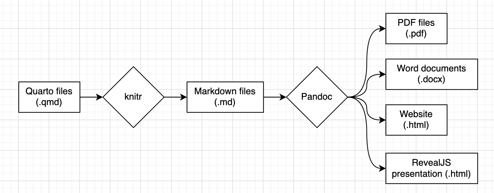

# What can Quarto do?

## Website

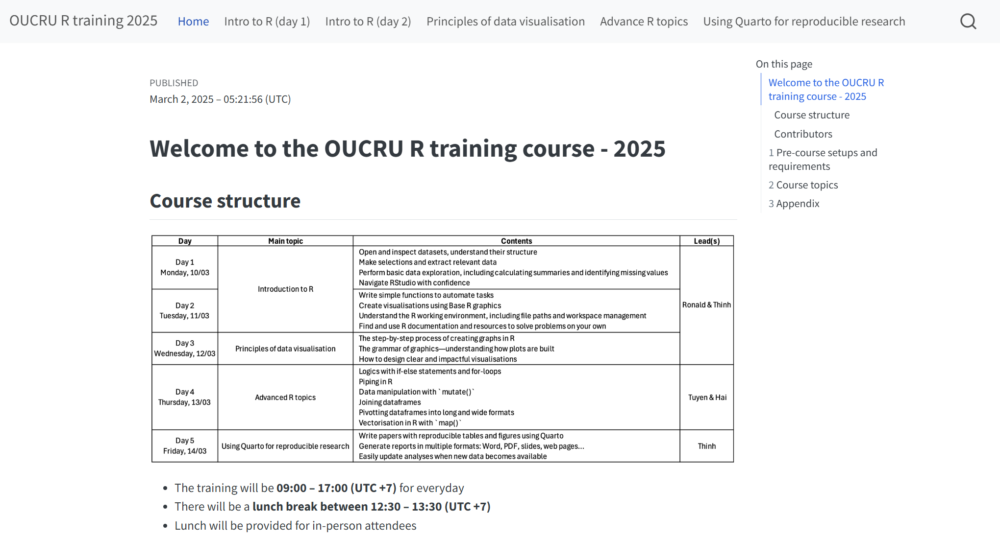

## Presentation


## Report/Manuscript

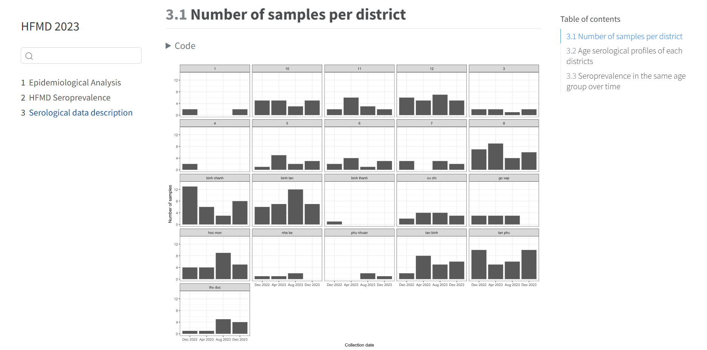

## Dashboard

::::: columns
::: {.column width="35%"}
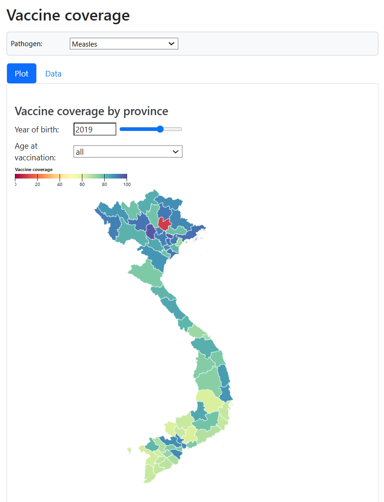
:::

::: {.column width="65%"}
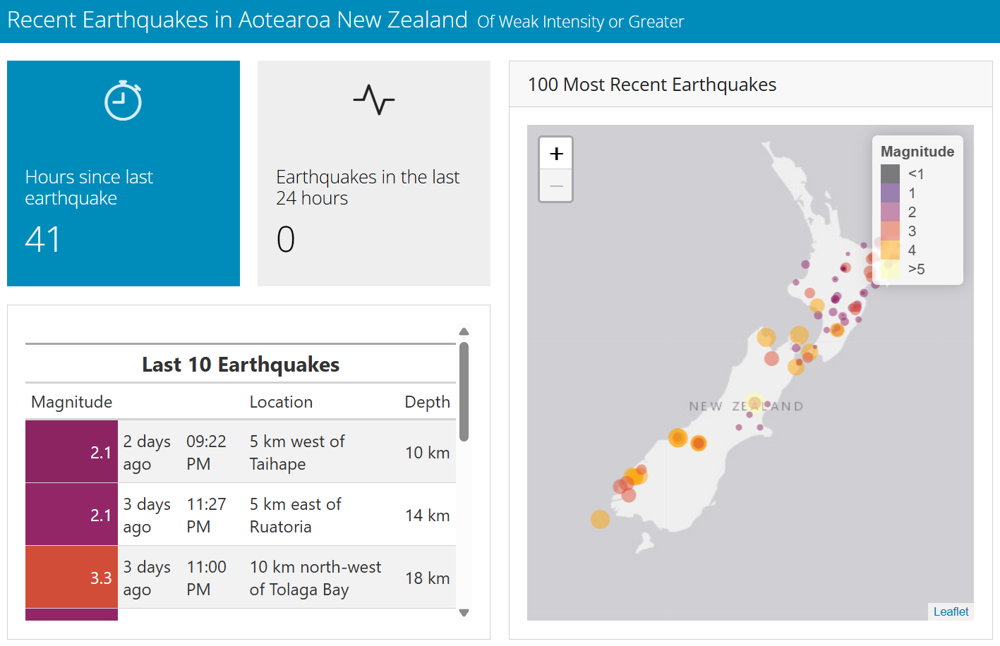
:::
:::::

## More examples

::::: columns
::: {.column width="70%"}
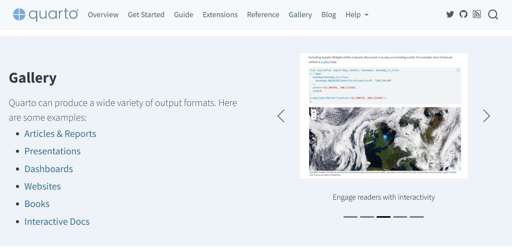
:::

::: {.column width="30%"}


Or click [here](https://quarto.org/docs/gallery/)
:::
:::::

## Creating a Quarto file

:::::: columns
::: {.column width="50%"}
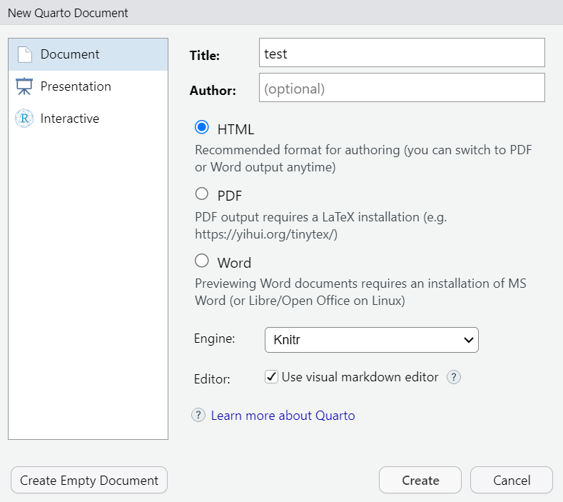
:::

::: {.column width="5%"}
:::

::: {.column width="45%"}
1.  Open RStudio
2.  Go to File \> New File \> Quarto Document
3.  Select the format you want
4.  Save the file with a `.qmd` extension
:::
::::::

## How to use Quarto?

::::::: columns
:::: {.column width="45%"}
::: {.codewindow .quarto}
index.qmd

```` markdown
---
title: "My Quarto file"
author: "Your Name"
date: "`r Sys.Date()`"
format: html
---

Summary of `mtcars`

```{{r}}
summary(mtcars)
```
````
:::
::::

::: {.column width="5%"}
:::

::: {.column width="50%"}
Main components of a Quarto file:

1.  Header (YAML metadata)
2.  Body (Markdown content and code chunks)
:::
:::::::

## Header {.smaller}

::::::: columns
:::: {.column width="45%"}
::: {.codewindow .quarto}
index.qmd

``` markdown
---
title: "My Quarto file"
author: "Your Name"
date: "`r Sys.Date()`"
format: html
---
```
:::
::::

::: {.column width="5%"}
:::

::: {.column width="50%"}
Defines document properties and settings, for examples:

-   `title`: Document title
-   `author`: Authorship
-   `date`: Date this document was published
-   `format`:
    -   Webpage: `html`
    -   Presentation: `revealjs`
    -   MS Word: `docx`
    -   Report/Manuscript: `pdf`
:::
:::::::

## Body

::::::: columns
:::: {.column width="50%"}
::: {.codewindow .quarto}
index.qmd

```` {.markdown code-line-numbers="false"}
---
title: "Hello, Quarto"
date: 2025-01-06
author: "Biostats and Modelling"
format: 
  html:
    code-overflow: wrap
    embed-resources: true
number-sections: true
navbar: false
toc: true
---

## Introduction to Quarto

Quarto is a publishing system that allows you to create documents, presentations, websites, and more using Markdown syntax and additional tools. 

## Header Levels

Quarto supports multiple header levels to create a hierarchical structure in your document. For example:

- Level 1 header: `# Header`
- Level 2 header: `## Subheader`
- Level 3 header: `### Sub-subheader`

### Nested Headers

Using headers, you can create nested sections to structure your document in a clear and organized way.

## Inline Text Formatting

You can format your text inline to add emphasis or other styling options.

- **Bold text**: `**bold**`
- *Italic text*: `*italic*`
- Inline `code`: `` `code` ``

> Blockquotes can be used to highlight important information or quotes by adding `> ` at the beginning of a line.

## Lists

Quarto supports both ordered and unordered lists.

### Unordered List

To create an unordered list, use an asterisk `*` before each item:

* First item
* Second item
* Third item

### Ordered List

To create an ordered list, use numbers before each item:

1. First item
2. Second item
3. Third item

## Links and images

<http://example.com>

[linked phrase](http://example.com)


## Tables

| First Header | Second Header |
|--------------|---------------|
| Content Cell | Content Cell  |
| Content Cell | Content Cell  |

## Code block

Quarto also supports code blocks, making it easy to include and execute code within your document. Here’s an example of a code block to create a simple plot using R:

```{{r}}
#| fig-width: 4
#| fig-height: 3
#| out-width: "100%"
x <- c(1, 2, 3, 4, 5)
y <- c(1, 4, 9, 16, 25)

plot(x, y, type = "o", col = "blue", main = "Simple plot", xlab = "x", ylab = "y")
```

## Footnotes

Footnotes can be added inline to provide additional information or references. Here's an example of a footnote in Quarto: ^[This is an example footnote.]
````
:::
::::

:::: {.column width="50%"}
::: {.codewindow .html}
index.html <iframe class="slide-deck" src="qt-example.html" style="width: 100%; height: 484.47px;"></iframe>
:::
::::
:::::::

## MS Word-like interface

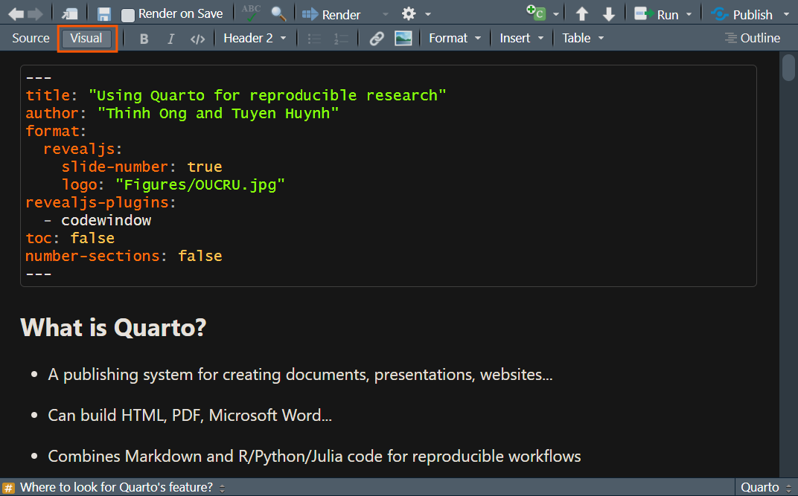

## Rendering output

1.  Save your Quarto file.
2.  Render it using the "Render" button in RStudio or by pressing `Ctrl+Shift+K`.


## Exploring Quarto


## Exploring Quarto

[![][1]][2]{target="_blank"}

[1]:  figures/qt/qt-search-2.png
[2]:  https://quarto.org/ "Let's try it out"

# Let's write a manuscript

## Create tables

-   There are many packages to create beautiful tables in R:

-   [`flextable`](https://davidgohel.github.io/flextable/)

-   [`huxtable`](https://hughjonesd.github.io/huxtable/)

-   [`gtsummary`](https://www.danieldsjoberg.com/gtsummary/)

-   In this course, we will use `gtsummary`.

## Data

First let's load the packages and have a look at the dataset.

```{r}
library(tidyverse)
library(gtsummary)

df <- readRDS("data/simulated_covid.rds")
head(df)
```

## Descriptive tables

:::::: columns
:::: {.column width="60%"}
::: {.codewindow .r}
```{r}
#| eval: false
df |> 
  tbl_summary(
    include = c(sex, age, outcome, outbreak)
  )
```
:::
::::

::: {.column width="40%"}
```{r}
#| echo: false
df |> 
  tbl_summary(
    include = c(sex, age, outcome, outbreak)
  )
```
:::
::::::

## Fix the labels

:::::: columns
:::: {.column width="60%"}
::: {.codewindow .r}
```{r}
#| eval: false
#| code-line-numbers: "4-7"
df |>
  tbl_summary(
    include = c(sex, age, outcome, outbreak),
    label = list(
      sex ~ "Sex", age ~ "Age (years)", 
      outcome ~ "Outcome", outbreak ~ "Outbreak"
    )
  )
```
:::
::::

::: {.column width="40%"}
```{r}
#| echo: false
df |>
  tbl_summary(
    include = c(sex, age, outcome, outbreak),
    label = list(sex ~ "Sex", age ~ "Age (years)", outcome ~ "Outcome", outbreak ~ "Outbreak")
  )
```
:::
::::::

## Correct the values

:::::: columns
:::: {.column width="60%"}
::: {.codewindow .r}
```{r}
#| eval: false
#| code-line-numbers: "2-7"
df |>
  mutate(sex = factor(
    sex,
    levels = c("f", "m"),
    labels = c("Female", "Male")
  ),
  outcome = str_to_sentence(outcome)) |>
  tbl_summary(
    include = c(sex, age, outcome, outbreak),
    label = list(
      sex ~ "Sex", age ~ "Age (years)", 
      outcome ~ "Outcome", outbreak ~ "Outbreak"
    )
  )
```
:::
::::

::: {.column width="40%"}
```{r}
#| echo: false
df |>
  mutate(sex = factor(
    sex,
    levels = c("f", "m"),
    labels = c("Female", "Male")
  ),
  outcome = str_to_sentence(outcome)) |>
  tbl_summary(
    include = c(sex, age, outcome, outbreak),
    label = list(sex ~ "Sex", age ~ "Age (years)", outcome ~ "Outcome", outbreak ~ "Outbreak")
  )
```
:::
::::::

## Decimal places

:::::: columns
:::: {.column width="60%"}
::: {.codewindow .r}
```{r}
#| eval: false
#| code-line-numbers: "14-17"
df |>
  mutate(sex = factor(
    sex,
    levels = c("f", "m"),
    labels = c("Female", "Male")
  ),
  outcome = str_to_sentence(outcome)) |>
  tbl_summary(
    include = c(sex, age, outcome, outbreak),
    label = list(
      sex ~ "Sex", age ~ "Age (years)", 
      outcome ~ "Outcome", outbreak ~ "Outbreak"
    ),
    digits = c(
      all_categorical() ~ c(0, 1), 
      all_continuous() ~ 1
    )
  )
```
:::
::::

::: {.column width="40%"}
```{r}
#| echo: false
df |>
  mutate(sex = factor(
    sex,
    levels = c("f", "m"),
    labels = c("Female", "Male")
  ),
  outcome = str_to_sentence(outcome)) |>
  tbl_summary(
    include = c(sex, age, outcome, outbreak),
    label = list(sex ~ "Sex", age ~ "Age (years)", outcome ~ "Outcome", outbreak ~ "Outbreak"),
    digits = c(all_categorical() ~ c(0, 1), all_continuous() ~ 1)
  )
```
:::
::::::

## Use mean or median

:::::: columns
:::: {.column width="60%"}
::: {.codewindow .r}
```{r}
#| eval: false
#| code-line-numbers: "18-20"
df |>
  mutate(sex = factor(
    sex,
    levels = c("f", "m"),
    labels = c("Female", "Male")
  ),
  outcome = str_to_sentence(outcome)) |>
  tbl_summary(
    include = c(sex, age, outcome, outbreak),
    label = list(
      sex ~ "Sex", age ~ "Age (years)", 
      outcome ~ "Outcome", outbreak ~ "Outbreak"
    ),
    digits = c(
      all_categorical() ~ c(0, 1), 
      all_continuous() ~ 1
    ),
    statistic = list(
      all_continuous() ~ "{mean} \u00b1 {sd}"
    )
  )
```
:::
::::

::: {.column width="40%"}
```{r}
#| echo: false
df |>
  mutate(sex = factor(
    sex,
    levels = c("f", "m"),
    labels = c("Female", "Male")
  ),
  outcome = str_to_sentence(outcome)) |>
  tbl_summary(
    include = c(sex, age, outcome, outbreak),
    label = list(sex ~ "Sex", age ~ "Age (years)", outcome ~ "Outcome", outbreak ~ "Outbreak"),
    digits = c(all_categorical() ~ c(0, 1), all_continuous() ~ 1),
    statistic = list(
      all_continuous() ~ "{mean} \u00b1 {sd}"
    )
  )
```
:::
::::::

## Make a plot

:::::: columns
:::: {.column width="50%"}
::: {.codewindow .r}
```{r}
#| eval: false
df |>
  count(date_onset) |>
  ggplot(aes(x = date_onset, y = n)) +
  geom_bar(stat = "identity",
           width = 1,
           fill = "cornflowerblue") +
  labs(x = "Date of onset", 
       y = "Case count") +
  theme_minimal()
```
:::
::::

::: {.column width="50%"}
```{r}
#| echo: false
#| fig-width: 4
#| fig-height: 3
#| out-width: "100%"
df |>
  count(date_onset) |>
  ggplot(aes(x = date_onset, y = n)) +
  geom_bar(stat = "identity",
           width = 1,
           fill = "cornflowerblue") +
  labs(x = "Date of onset", 
       y = "Case count") +
  theme_minimal()
```
:::
::::::

## Reuse code with new data

What if we only care about the 1st outbreak?

:::::: columns
:::: {.column width="50%"}
::: {.codewindow .r}
```{r}
#| eval: false
df |>
  count(date_onset) |>
  ggplot(aes(x = date_onset, y = n)) +
  geom_bar(stat = "identity",
           width = 1,
           fill = "cornflowerblue") +
  labs(x = "Date of onset", 
       y = "Case count") +
  theme_minimal()
```
:::
::::

::: {.column width="50%"}
```{r}
#| echo: false
#| fig-width: 4
#| fig-height: 3
#| out-width: "100%"
df |>
  count(date_onset) |>
  ggplot(aes(x = date_onset, y = n)) +
  geom_bar(stat = "identity",
           width = 1,
           fill = "cornflowerblue") +
  labs(x = "Date of onset", 
       y = "Case count") +
  theme_minimal()
```
:::
::::::

## Reuse code with new data

What if we only care about the 1st outbreak?

:::::: columns
:::: {.column width="50%"}
::: {.codewindow .r}
```{r}
#| eval: false
#| code-line-numbers: "1-2"
df <- df |> 
  filter(outbreak == "1st outbreak")
df |>
  count(date_onset) |>
  ggplot(aes(x = date_onset, y = n)) +
  geom_bar(stat = "identity",
           width = 1,
           fill = "cornflowerblue") +
  labs(x = "Date of onset", 
       y = "Case count") +
  theme_minimal()
```
:::
::::

::: {.column width="50%"}
```{r}
#| echo: false
#| fig-width: 4
#| fig-height: 3
#| out-width: "100%"
df <- df |> 
  filter(outbreak == "1st outbreak")
df |>
  count(date_onset) |>
  ggplot(aes(x = date_onset, y = n)) +
  geom_bar(stat = "identity",
           width = 1,
           fill = "cornflowerblue") +
  labs(x = "Date of onset", 
       y = "Case count") +
  theme_minimal()
```
:::
::::::

## Reuse code with new data

:::::: columns
:::: {.column width="60%"}
::: {.codewindow .r}
```{r}
#| eval: false
df |>
  mutate(sex = factor(
    sex,
    levels = c("f", "m"),
    labels = c("Female", "Male")
  ),
  outcome = str_to_sentence(outcome)) |>
  tbl_summary(
    include = c(sex, age, outcome, outbreak),
    label = list(
      sex ~ "Sex", age ~ "Age (years)", 
      outcome ~ "Outcome", outbreak ~ "Outbreak"
    ),
    digits = c(
      all_categorical() ~ c(0, 1), 
      all_continuous() ~ 1
    ),
    statistic = list(
      all_continuous() ~ "{mean} \u00b1 {sd}"
    )
  )
```
:::
::::

::: {.column width="40%"}
```{r}
#| echo: false
df |>
  mutate(sex = factor(
    sex,
    levels = c("f", "m"),
    labels = c("Female", "Male")
  ),
  outcome = str_to_sentence(outcome)) |>
  tbl_summary(
    include = c(sex, age, outcome, outbreak),
    label = list(sex ~ "Sex", age ~ "Age (years)", outcome ~ "Outcome", outbreak ~ "Outbreak"),
    digits = c(all_categorical() ~ c(0, 1), all_continuous() ~ 1),
    statistic = list(
      all_continuous() ~ "{mean} \u00b1 {sd}"
    )
  )
```
:::
::::::

## Add citation

-   You can add citations to the text using Quarto

-   The easiest way to do this is via the `Visual` view

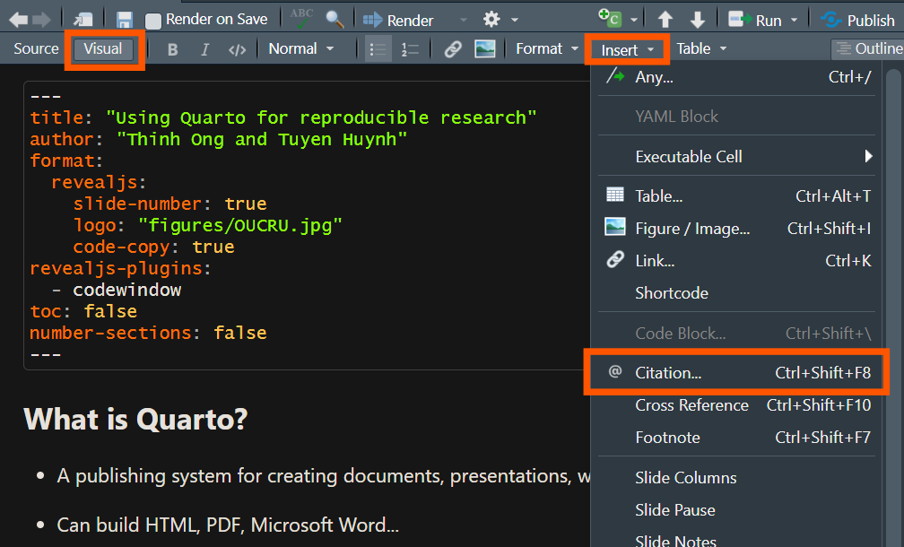

## Add citation

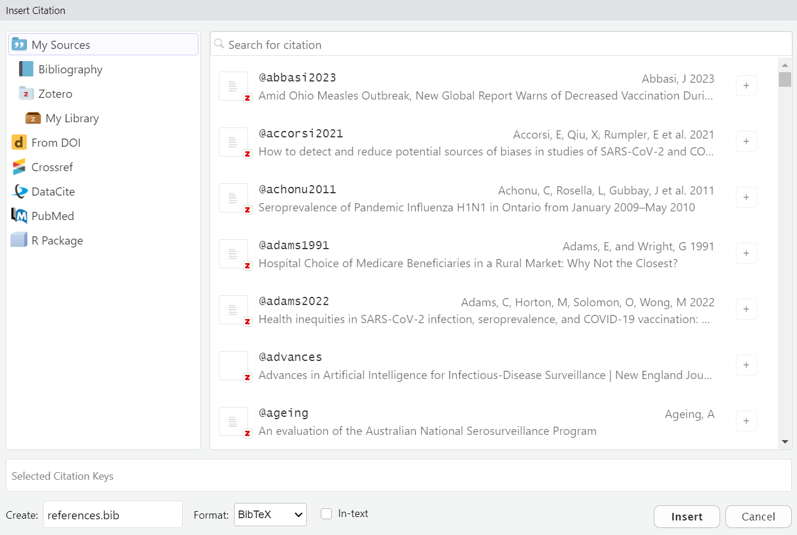

## Template

-   Templates help make your document look professional without extra effort

-   You can use pre-built templates or create your own for a custom style

-   Some templates are designed for academic journals, presentations, or reports

-   [Click here](https://github.com/quarto-journals/) to see a list of available journal templates in Quarto

## What is a Quarto template? {.smaller}

> A Quarto template is a **pre-designed document** layout that controls the **appearance** of your output (PDF, Word, HTML, or presentation).

Let's try a template for journals published by Elsevier.

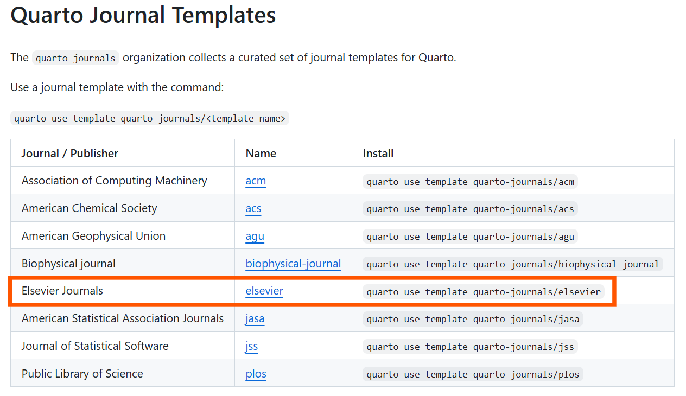

## Template {.smaller}

Paste this code in the **terminal** (not the console or your coding panel).

::: codewindow
``` markdown
quarto use template quarto-journals/elsevier
```
:::

Say "Yes" to everything it gonna ask.

::::: columns
::: {.column width="50%"}
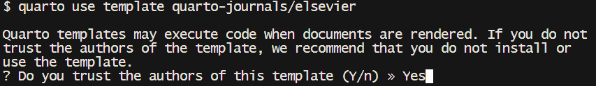

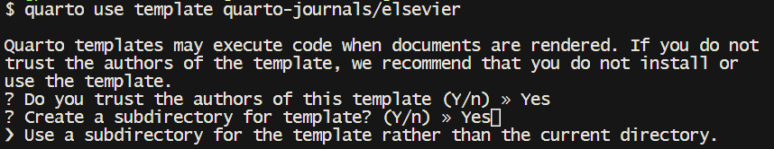
:::

::: {.column width="50%"}
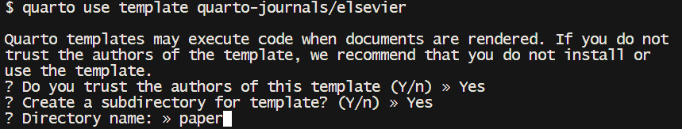
:::
:::::

## Template {.smaller}

:::::: columns
:::: {.column width="50%"}
::: {.codewindow .quarto}
paper.qmd
```` {.markdown code-line-numbers="false"}
---
title: Short Paper
subtitle: A Short Subtitle
author:
  - name: Alice Anonymous
    email: alice@example.com
    affiliations: 
        - id: some-tech
          name: Some Institute of Technology
          department: Department Name
          address: Street Address
          city: City
          state: State
          postal-code: Postal Code
    attributes:
        corresponding: true
    note: This is the first author footnote.
  - name: Bob Security
    email: bob@example.com
    affiliations:
        - id: another-u
          name: Another University
          department: Department Name
          address: Street Address
          city: City
          state: State
          postal-code: Postal Code
    note: |
      Another author footnote, this is a very long footnote and it should be a really long footnote. But this footnote is not yet sufficiently long enough to make two lines of footnote text.
  - name: Cat Memes
    email: cat@example.com
    affiliations:
        - ref: another-u
    note: Yet another author footnote.
  - name: Derek Zoolander
    email: derek@example.com
    affilations:
        - ref: some-tech
abstract: |
  This is the abstract. Lorem ipsum dolor sit amet, consectetur adipiscing elit. Vestibulum augue turpis, dictum non malesuada a, volutpat eget velit. Nam placerat turpis purus, eu tristique ex tincidunt et. Mauris sed augue eget turpis ultrices tincidunt. Sed et mi in leo porta egestas. Aliquam non laoreet velit. Nunc quis ex vitae eros aliquet auctor nec ac libero. Duis laoreet sapien eu mi luctus, in bibendum leo molestie. Sed hendrerit diam diam, ac dapibus nisl volutpat vitae. Aliquam bibendum varius libero, eu efficitur justo rutrum at. Sed at tempus elit.
keywords: 
  - keyword1
  - keyword2
date: last-modified
bibliography: bibliography.bib
format:
  elsevier-pdf:
    keep-tex: true
    journal:
      name: Journal Name
      formatting: preprint
      # model: 3p # Don't set a model with preprint
      cite-style: authoryear
---

Please make sure that your manuscript follows the guidelines in the 
Guide for Authors of the relevant journal. It is not necessary to 
typeset your manuscript in exactly the same way as an article, 
unless you are submitting to a camera-ready copy (CRC) journal.

For detailed instructions regarding the elsevier article class, see   <https://www.elsevier.com/authors/policies-and-guidelines/latex-instructions>

# Bibliography styles

Here are two sample references:  @Feynman1963118 @Dirac1953888.

With this template using elsevier class, natbib will be used. Three bibliographic style files (*.bst) are provided and their use controled by `cite-style` option: 

- `citestyle: number` (default)  will use `elsarticle-num.bst` - can be used for the numbered scheme
- `citestyle: numbername` will use `elsarticle-num-names.bst` - can be used for numbered with new options of natbib.sty
- `citestyle: authoryear` will use `elsarticle-harv.bst` — can be used for author year scheme

This `citestyle` will insert the right `.bst` and set the correct `classoption` for `elsarticle` document class.

Using `natbiboptions` variable in YAML header, you can set more options for `natbib` itself . Example 

```yaml
natbiboptions: longnamesfirst,angle,semicolon
```

## Using CSL 

If `cite-method` is set to `citeproc` in `elsevier_article()`, then pandoc is used for citations instead of `natbib`. In this case, the `csl` option is used to format the references. By default, this template will provide an appropriate style, but alternative `csl` files are available from <https://www.zotero.org/styles?q=elsevier>. These can be downloaded
and stored locally, or the url can be used as in the example header.

# Equations

Here is an equation:
$$ 
  f_{X}(x) = \left(\frac{\alpha}{\beta}\right)
  \left(\frac{x}{\beta}\right)^{\alpha-1}
  e^{-\left(\frac{x}{\beta}\right)^{\alpha}}; 
  \alpha,\beta,x > 0 .
$$

Inline equations work as well: $\sum_{i = 2}^\infty\{\alpha_i^\beta\}$

# Figures and tables

@fig-meaningless is generated using an R chunk.

```{{r}}
#| label: fig-meaningless
#| fig-cap: A meaningless scatterplot
#| fig-width: 5
#| fig-height: 5
#| fig-align: center
#| out-width: 50%
#| echo: false
plot(runif(25), runif(25))
```

# Tables coming from R

Tables can also be generated using R chunks, as shown in @tbl-simple example.

```{{r}}
#| label: tbl-simple
#| tbl-cap: Caption centered above table
#| echo: true
knitr::kable(head(mtcars)[,1:4])
```

# References {-}
````
:::
::::

::: {.column width="50%"}
<embed src="figures/paper.pdf" height="590px" width="500px" />
:::
::::::
