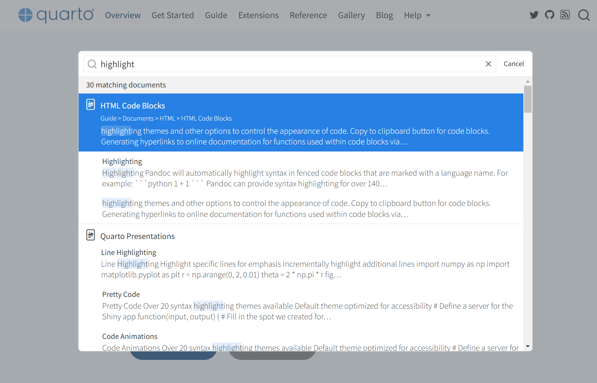

## What is Quarto?

-   A publishing system for creating documents, presentations, websites...

-   Can build HTML, PDF, Microsoft Word...

-   Combines Markdown and R/Python/Julia code for reproducible workflows

-   Integrated into RStudio by default

## How does Quarto work?


# What can Quarto do?

## Website


## Report/Manuscript


## Dashboard


## More examples

:::: columns

::: {.column width="70%"}


:::

::: {.column width="30%"}



Or click [here](https://quarto.org/docs/gallery/)

:::

::::

## Creating a Quarto file

:::::: columns
::: {.column width="50%"}

:::

::: {.column width="5%"}
:::

::: {.column width="45%"}
1.  Open RStudio
2.  Go to File \> New File \> Quarto Document
3.  Select the format you want
4.  Save the file with a `.qmd` extension
:::
::::::

## How to use Quarto?

::::::: columns
:::: {.column width="45%"}
::: {.codewindow .quarto}
index.qmd

```` markdown
---
title: "My Quarto file"
author: "Your Name"
date: "`r Sys.Date()`"
format: html
---

Summary of `mtcars`

```{{r}}
summary(mtcars)
```
````
:::
::::

::: {.column width="5%"}
:::

::: {.column width="50%"}
Main components of a Quarto file:

1.  Header (YAML metadata)
2.  Body (Markdown content and code chunks)
:::
:::::::

## Header

::::::: columns
:::: {.column width="45%"}
::: {.codewindow .quarto}
index.qmd

``` markdown
---
title: "My Quarto file"
author: "Your Name"
date: "`r Sys.Date()`"
format: html
---
```
:::
::::

::: {.column width="5%"}
:::

::: {.column width="50%"}
Defines document properties and settings, for examples:

-   `title`: Document title
-   `author`: Authorship
-   `date`: Date this document was published
-   `format`: `html`, `docx`, or `pdf`
:::
:::::::

## Body

::::::: columns
:::: {.column width="50%"}
::: {.codewindow .quarto}
index.qmd

````{.markdown code-line-numbers="false"}
---
title: "Hello, Quarto"
date: 2025-01-06
author: "Biostats and Modelling"
format: 
  html:
    code-overflow: wrap
    embed-resources: true
number-sections: true
navbar: false
toc: true
---

## Introduction to Quarto

Quarto is a publishing system that allows you to create documents, presentations, websites, and more using Markdown syntax and additional tools. 

## Header Levels

Quarto supports multiple header levels to create a hierarchical structure in your document. For example:

- Level 1 header: `# Header`
- Level 2 header: `## Subheader`
- Level 3 header: `### Sub-subheader`

### Nested Headers

Using headers, you can create nested sections to structure your document in a clear and organized way.

## Inline Text Formatting

You can format your text inline to add emphasis or other styling options.

- **Bold text**: `**bold**`
- *Italic text*: `*italic*`
- Inline `code`: `` `code` ``

> Blockquotes can be used to highlight important information or quotes by adding `> ` at the beginning of a line.

## Lists

Quarto supports both ordered and unordered lists.

### Unordered List

To create an unordered list, use an asterisk `*` before each item:

* First item
* Second item
* Third item

### Ordered List

To create an ordered list, use numbers before each item:

1. First item
2. Second item
3. Third item

## Links and images

<http://example.com>

[linked phrase](http://example.com)


## Tables

| First Header | Second Header |
|--------------|---------------|
| Content Cell | Content Cell  |
| Content Cell | Content Cell  |

## Code block

Quarto also supports code blocks, making it easy to include and execute code within your document. Here’s an example of a code block to create a simple plot using R:

```{r}
#| fig-width: 4
#| fig-height: 3
#| out-width: "100%"
x <- c(1, 2, 3, 4, 5)
y <- c(1, 4, 9, 16, 25)

plot(x, y, type = "o", col = "blue", main = "Simple plot", xlab = "x", ylab = "y")
```

## Footnotes

Footnotes can be added inline to provide additional information or references. Here's an example of a footnote in Quarto: ^[This is an example footnote.]
````
:::
::::

:::: {.column width="50%"}
::: {.codewindow .html}
index.html <iframe class="slide-deck" src="qt-example.html" style="width: 100%; height: 484.47px;"></iframe>
:::
::::
:::::::

## MS Word-like interface


## Rendering output

1.  Save your Quarto file.
2.  Render it using the "Render" button in RStudio or by pressing `Ctrl+Shift+K`.


## Exploring Quarto


## Exploring Quarto



# Let's write a manuscript

## Create tables

`gtsummary` is a package to make beautiful tables.

```{r}
library(tidyverse)
library(gtsummary)

df <- readRDS("data/simulated_covid.rds")
head(df)
```

## Descriptive tables

:::: columns

::: {.column width="60%"}

::: {.codewindow .r}
```{r}
#| eval: false
df %>% 
  tbl_summary(
    include = c(sex, age, outcome, outbreak)
  )
```
:::

:::

::: {.column width="40%"}

```{r}
#| echo: false
df %>% 
  tbl_summary(
    include = c(sex, age, outcome, outbreak)
  )
```

:::

::::

## Fix the labels

:::: columns

::: {.column width="60%"}

::: {.codewindow .r}
```{r}
#| eval: false
#| code-line-numbers: "4-7"
df %>%
  tbl_summary(
    include = c(sex, age, outcome, outbreak),
    label = list(
      sex ~ "Sex", age ~ "Age (years)", 
      outcome ~ "Outcome", outbreak ~ "Outbreak"
    )
  )
```
:::

:::

::: {.column width="40%"}

```{r}
#| echo: false
df %>%
  tbl_summary(
    include = c(sex, age, outcome, outbreak),
    label = list(sex ~ "Sex", age ~ "Age (years)", outcome ~ "Outcome", outbreak ~ "Outbreak")
  )
```

:::

::::

## Correct the values

:::: columns

::: {.column width="60%"}

::: {.codewindow .r}
```{r}
#| eval: false
#| code-line-numbers: "2-7"
df %>%
  mutate(sex = factor(
    sex,
    levels = c("f", "m"),
    labels = c("Female", "Male")
  ),
  outcome = str_to_sentence(outcome)) %>%
  tbl_summary(
    include = c(sex, age, outcome, outbreak),
    label = list(
      sex ~ "Sex", age ~ "Age (years)", 
      outcome ~ "Outcome", outbreak ~ "Outbreak"
    )
  )
```
:::

:::

::: {.column width="40%"}

```{r}
#| echo: false
df %>%
  mutate(sex = factor(
    sex,
    levels = c("f", "m"),
    labels = c("Female", "Male")
  ),
  outcome = str_to_sentence(outcome)) %>%
  tbl_summary(
    include = c(sex, age, outcome, outbreak),
    label = list(sex ~ "Sex", age ~ "Age (years)", outcome ~ "Outcome", outbreak ~ "Outbreak")
  )
```

:::

::::

## Decimal places

:::: columns

::: {.column width="60%"}

::: {.codewindow .r}
```{r}
#| eval: false
#| code-line-numbers: "14-17"
df %>%
  mutate(sex = factor(
    sex,
    levels = c("f", "m"),
    labels = c("Female", "Male")
  ),
  outcome = str_to_sentence(outcome)) %>%
  tbl_summary(
    include = c(sex, age, outcome, outbreak),
    label = list(
      sex ~ "Sex", age ~ "Age (years)", 
      outcome ~ "Outcome", outbreak ~ "Outbreak"
    ),
    digits = c(
      all_categorical() ~ c(0, 1), 
      all_continuous() ~ 1
    )
  )
```
:::

:::

::: {.column width="40%"}

```{r}
#| echo: false
df %>%
  mutate(sex = factor(
    sex,
    levels = c("f", "m"),
    labels = c("Female", "Male")
  ),
  outcome = str_to_sentence(outcome)) %>%
  tbl_summary(
    include = c(sex, age, outcome, outbreak),
    label = list(sex ~ "Sex", age ~ "Age (years)", outcome ~ "Outcome", outbreak ~ "Outbreak"),
    digits = c(all_categorical() ~ c(0, 1), all_continuous() ~ 1)
  )
```

:::

::::

## Use mean or median

:::: columns

::: {.column width="60%"}

::: {.codewindow .r}
```{r}
#| eval: false
#| code-line-numbers: "18-20"
df %>%
  mutate(sex = factor(
    sex,
    levels = c("f", "m"),
    labels = c("Female", "Male")
  ),
  outcome = str_to_sentence(outcome)) %>%
  tbl_summary(
    include = c(sex, age, outcome, outbreak),
    label = list(
      sex ~ "Sex", age ~ "Age (years)", 
      outcome ~ "Outcome", outbreak ~ "Outbreak"
    ),
    digits = c(
      all_categorical() ~ c(0, 1), 
      all_continuous() ~ 1
    ),
    statistic = list(
      all_continuous() ~ "{mean} \u00b1 {sd}"
    )
  )
```
:::

:::

::: {.column width="40%"}

```{r}
#| echo: false
df %>%
  mutate(sex = factor(
    sex,
    levels = c("f", "m"),
    labels = c("Female", "Male")
  ),
  outcome = str_to_sentence(outcome)) %>%
  tbl_summary(
    include = c(sex, age, outcome, outbreak),
    label = list(sex ~ "Sex", age ~ "Age (years)", outcome ~ "Outcome", outbreak ~ "Outbreak"),
    digits = c(all_categorical() ~ c(0, 1), all_continuous() ~ 1),
    statistic = list(
      all_continuous() ~ "{mean} \u00b1 {sd}"
    )
  )
```

:::

::::

## Make a plot


## Add citation


